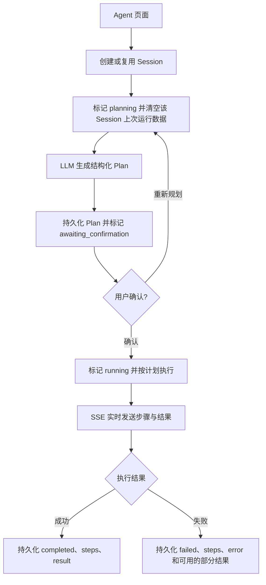

# Agent 功能与实现说明

本文整理项目中“Agent 生成”“对话创作”和“Agent 续写改编”的功能边界、执行流程、Session 持久化、前后端入口与扩展方式。内容以当前代码实现为准。

## 1. 功能总览

| 模式 | Session mode | 前端路由 | 作用 |
|------|--------------|----------|------|
| Agent 生成 | `generate` | `/projects/:projectId/agent` | 从一句想法生成结构化蓝图，并创建项目资料、大纲、人物、场景、章节及部分正文 |
| 对话创作 | `chat_generate` | `/projects/:projectId/agent-chat` | 通过 Codex 式问题卡依次确认核心设定、分卷大纲、人物、场景、章节与质量策略，再生成单章、多章或全部章节 |
| Agent 续写改编 | `continue_edit` | `/projects/:projectId/agent-continue` | 让 LLM 基于已有章节生成可执行 Plan，再复用小说 AI 生成和 AI 打磨逐步执行 |

三种模式都要求用户先创建并进入一个项目。Agent 不创建最外层 `Project` 记录，只在当前项目范围内工作。

共同能力：

- 先由 LLM 生成结构化 Plan，持久化后等待用户确认；
- 只有用户点击确认后，才会创建或修改项目内容；
- 通过 SSE 将计划、待执行步骤、当前步骤、进度和结果实时返回前端；
- 通过 Agent Session 持久化请求、Plan、最终步骤、结果和错误；
- Session 默认名称等于 Session ID，可在页面重命名、切换、新建或删除；
- Session 与项目和模式绑定，不能跨项目或跨模式复用。

## 2. 总体调用链



当前 Session 是运行记录，不是后台任务队列。浏览器刷新后可以读取已经持久化的 Plan 和结果，但不能重新订阅已经断开的执行流，也不支持从中断步骤自动续跑。

## 3. Agent 生成

### 3.1 接口

前端使用流式接口：

```http
POST /api/v1/projects/{project_id}/novel-agent/write-stream
```

该接口只生成蓝图并进入等待确认状态。确认执行使用：

```http
POST /api/v1/projects/{project_id}/novel-agent/write-execute-stream
```

确认请求体为 `{"session_id":"..."}`。确认前不会更新项目信息，也不会创建大纲、人物、场景、章节或正文。

同步兼容接口：

```http
POST /api/v1/projects/{project_id}/novel-agent/write
```

请求中的 `session_id` 可省略。省略时后端自动创建 `mode=generate` 的 Session；传入时只接受当前项目中相同模式的 Session。

### 3.2 蓝图生成

服务读取以下系统设置并调用 LLM JSON Object 模式：

- `novel_agent.blueprint_system`
- `novel_agent.blueprint_user_template`
- `novel_agent.blueprint_temperature`

用户模板会注入创意、题材、文风、额外要求、卷数、章节数和目标总字数。普通模型的蓝图输出预算为 32768 tokens；DeepSeek 官方 V4 接口会自动使用当前文档标明的最大输出预算 384K（393216 tokens），不再受 LLM 配置中较小的默认 `max_tokens` 限制。

依据：

- [DeepSeek 模型 & 价格](https://api-docs.deepseek.com/zh-cn/quick_start/pricing)：V4 上下文长度 1M，最大输出 384K；
- [DeepSeek Responses API](https://api-docs.deepseek.com/zh-cn/guides/responses_api)：支持 `max_output_tokens`，但不支持 `previous_response_id` 和 `conversation`，接口为无状态调用。

蓝图的主要结构包括：

```json
{
  "project": {},
  "style_guide": "正文风格指南",
  "outline": { "children": [] },
  "characters": [],
  "scenes": [],
  "agent_plan": []
}
```

程序至少要求 `project` 和 `outline` 为 JSON 对象。返回内容会依次尝试直接解析、移除 Markdown 代码围栏后解析，以及从混合文本中截取完整 JSON 对象。

Session 的 `plan` 保存完整蓝图，而不仅是蓝图内部的 `agent_plan`。

### 3.3 固定执行步骤

`NovelAgentService.write_from_idea_stream()` 按以下顺序执行：

1. `plan_blueprint`：蓝图生成；
2. `create_project`：可选更新项目名称、简介、题材、目标字数和设置；
3. `create_outline`：创建分卷分章大纲树；
4. `create_characters`：创建人物档案；
5. `create_scenes`：创建场景卡片；
6. `create_chapters`：按大纲章节节点创建章节草稿；
7. `write_chapters`：复用 `ChapterService.novel_write()` 生成前 N 章正文。

蓝图中的 `agent_plan` 是规划信息，当前不会改变上述后端执行顺序。

### 3.4 写入规则

- 每次运行都会新建一份大纲，不覆盖已有大纲；
- 人物、场景和章节会追加到当前项目，不自动去重；
- `chapter_count` 表示全书所有卷合计生成的章节总数，不是每卷章数；各卷可按剧情需要分配不同数量的章节，蓝图会校验卷数与总章数；
- `write_chapter_count=0` 时只生成结构，不生成正文；
- `update_project=false` 只跳过项目元信息更新，不影响其他资源创建；
- 正文写作复用现有大纲、人物、场景、前文和文风上下文。

最终 `result` 保存项目、大纲、人物、场景、当前章节列表、已生成正文的章节、蓝图和步骤。

## 4. 对话创作 Agent

### 4.1 对话接口

```http
POST /api/v1/projects/{project_id}/novel-agent/chat-turn-stream
```

请求体：

```json
{
  "session_id": "可省略；省略时新建 chat_generate 会话",
  "llm_config_id": "LLM 配置 ID",
  "message": "初始创意或当前问题的自由回答",
  "answers": [
    {
      "question_id": "quality_gate:8:1",
      "option_id": "yes",
      "custom_text": null
    }
  ]
}
```

DeepSeek `deepseek-v4-flash` 与 `deepseek-v4-pro` 默认使用无状态 Responses API；本地 Session 是恢复来源，每轮不依赖供应商保存会话。需要兼容旧调用链时可显式切回 Chat Completions。OpenAI、Anthropic、Gemini 和 OpenAI-Compatible 配置通过统一结构化输出适配层使用同一状态机。

### 4.2 确定性状态机

```text
创意 → 故事方向选项
→ 核心设定与创作规则手册/确认
→ 按卷生成分卷大纲 → 完整分卷大纲/确认
→ 人物范围（单人物/多人物）→ 人物草案/确认
→ 场景范围（单场景/多场景）→ 场景草案/确认
→ 章节方式（逐章/分批/全部）→ 章节合同/确认
→ 写作范围（单章/多章/全部）
→ 一致性分析选项 + 自动打磨选项
→ 按章生成 → 可选分析 → 可选打磨 → 实际故事状态提取
→ 若仍有未写章节：继续生成/结束本次创作 → 刷新状态后返回写作范围
```

模型负责生成候选方案、选项文案和创作产物；后端只允许白名单阶段迁移和动作。每个问题严格包含 2–3 个互斥选项、唯一推荐项和可选自由输入。问题 ID 包含 `state_version`，旧页面或重复请求不能回答已经过期的问题。

核心设定、分卷大纲、人物、场景和章节都先生成草案，用户可选择“确认并继续”“按反馈修改”或“重新生成”。结构全部确认前不写入正式大纲、人物、场景或章节记录。

各阶段的最新草案直接跟随对应的产物说明消息显示在对话流中；核心设定、大纲、人物、场景、章节和已确认的质量策略统一默认预览 5 行，更多内容通过“展开 / 收起”查看。同阶段修改或重做时只展示最新版本，旧会话缺少消息锚点时则在当前对话末尾兜底显示。

核心设定与分卷大纲不再由一次 LLM 调用同时生成：

- `foundation` 子步骤只生成项目定位、世界硬规则、长期伏笔、结局方向、叙事/连续性/禁区规则、文风指南和大纲标题信息，`outline.children` 必须为空；非 DeepSeek 模型的默认请求预算为 8000 tokens，DeepSeek V4 自动提升到官方最大 384K；
- 作者确认 `foundation` 后，`outline_volume` 按一卷一次调用；非 DeepSeek 模型的单卷默认预算为 7000 tokens，DeepSeek V4 自动提升到 384K；每卷只允许返回一个 `VOLUME`，不生成章节；
- 项目简介、文风、大纲概述、每卷摘要、metadata 和规则项不再设置固定字符上限，也不会在本地归一化或最终组装时截断；项目名、题材和标题仍遵守持久化字段的安全长度；
- 支持 strict schema 的接口使用严格 JSON Schema；DeepSeek 降级为官方支持的 JSON Object 模式，并由本地 normalizer 强制执行必需字段、数组数量、单卷对象、空 `children` 和目标字数等结构约束。结构不合格时只定向重试当前子步骤一次；
- `node_type` 缺失或大小写偏差会在明确的单卷上下文中规范为 `VOLUME`，最终卷数由程序按目标规模组装，不再依赖模型一次返回恰好 N 卷；
- 每完成一卷立即提交恢复检查点；后续卷失败或浏览器断线时，已完成的设定和分卷不会重新调用 LLM。

章节合同中的 `target_chars` 会在服务端统一限制为 1500–12000，并按模型给出的相对篇幅权重重新缩放，使所有章节之和闭合到当前规模下可执行的全书目标；模型返回的越界或失衡数值不会直接进入正文任务。

### 4.3 章节质量流水线

正文开始前会分别询问：

- 是否运行人物、剧情、时间线和内容一致性分析；
- 是否在分析后自动打磨；
- 多章任务是对全部所选章节确认一次，还是每章生成前再次询问。

质量选项确认后会立即保存并发送 `quality` artifact，展示一致性分析、自动打磨、应用范围和目标章节数；逐章确认时该产物更新为当前待执行策略。

单章或部分批次完成后，Session 不会直接结束。服务会按项目中每章的实际 `content` / `word_count` 刷新已写状态；仍有未写章节时询问“继续生成”或“结束本次创作”。继续后返回写作范围并只展示剩余章节，全部章节已写完或作者主动结束时才将 Session 标记为 `completed`。

单章执行顺序固定为：

```text
已有正文自动备份 → 生成正文 → 可选一致性分析
→ 自动打磨前保存草稿版本 → 可选打磨目标章
→ 从最终正文提取 story_state.v1 → 保存执行检查点
```

相邻章节在打磨中始终是只读证据。任何一致性维度调用或 JSON 校验失败都会保存 `failed` 报告，并阻止依赖该报告的自动打磨，避免把模型错误误报为“没有问题”。

实际状态提取只接受正文中有证据的事实，累计人物位置/知识、物品状态、关系变化、开放线索、伏笔和章节实际摘要。人物、物品和故事时钟按字段深合并；开放线索通过 `opened_threads` / `resolved_threads` 增量更新，不会因模型只返回局部状态而误删旧事实。章节合同和状态增量都按持久化后的章节 ID 绑定，重复标题不会串用；生成目标章时只按绝对章序重放它之前的增量。同章重写会替换旧增量；若新正文生成后的状态提取失败，则保留安全的状态缺口，而不会继续使用旧正文事实。聚合状态同时保存在 Agent Session 与 `Project.settings.story_state`，后续章节优先使用它，而不是把原计划摘要当作已经发生的事实。

每次正文生成都使用独立的上下文窗口，只发送固定写作规则和当前章所需的动态材料：小说圣经、当前卷与本章合同、合同明确引用的人物/场景、目标章之前的连续性状态，以及紧邻前章的限长正文。对话消息、其他阶段产物、未被本章合同引用的实体和上一章的模型消息不会进入该窗口；项目中的 `story_state` 不会与 Session 状态重复注入。若作者乱序生成章节，只允许早于目标章的状态快照进入提示词，避免未来章节事实泄露到前章。

“Agent 生成”确认蓝图后也复用同一章节窗口和状态账本。服务会在蓝图保存及旧 Session 执行前补齐 `pov`、`scene_focus`、`characters`、`hook` 与高级合同字段，并把每章 `target_chars` 限制在 1500–12000 后按相对权重重缩放，使全书可执行目标字数闭合；多章正文按项目绝对章序串行落库，后一章可使用前一章刚提取的实际状态。

### 4.4 缓存友好的消息格式

- 固定、版本化的 Agent Kernel 和长篇写作规则位于 system 前缀；
- 小说圣经、大纲和已确认实体使用稳定排序 JSON；
- 时间戳和运行进度不进入稳定前缀；
- 当前状态、章节合同、正文与本轮回答放在消息末端；
- OpenAI 可发送稳定的 `prompt_cache_key`，DeepSeek 自动利用精确前缀缓存；统一结果会保留 cached input token 用量。

会话快照位于 `request_payload.chat_state`，包含 stage、state_version、messages、pending_questions、artifacts、quality_policy、execution checkpoint 和 `llm_usage`。后者累计 input/output/cached/reasoning tokens 与实际缓存命中比例，并为每次调用记录 finish status、响应字符数和输出预算；刷新或切换页面后可恢复当前问题与已生成产物。

每次接受用户输入后、进入长时间模型调用前，服务会先保存 `inflight_turn` 和“恢复生成”问题。分卷大纲每完成一卷、批量写作每完成一章都会刷新该检查点。浏览器断线、模型错误或中途失败后，用户可以从最近检查点继续，或返回上一问题重新选择；已经完成的分卷或章节不会因恢复批次而重复执行。前端收到 SSE error 后会自动重新读取 Session，使服务端已保存的恢复问题立即显示。

章节合同采用“单章逐批”或“分批生成”时，每完成一批也会保存已规划合同；恢复后从下一批继续，不会重复调用已完成批次。这里保存的是章节规划，不是正文；只有完整规划经作者确认并完成正文范围与质量策略选择后，才会写作章节正文。

## 5. Agent 续写改编

### 5.1 接口与上下文

```http
POST /api/v1/projects/{project_id}/novel-agent/continue-stream
```

该接口只生成续写改编 Plan。用户确认后调用：

```http
POST /api/v1/projects/{project_id}/novel-agent/continue-execute-stream
```

确认请求体为 `{"session_id":"..."}`。确认前不会创建缺失的章节记录或章节版本快照，也不会生成、打磨或覆盖任何章节正文。

该模式只操作当前项目已有章节记录，以及大纲中已经规划但尚未创建章节记录的 `CHAPTER` 节点；不会创建项目、大纲、人物、场景，也不会编造大纲之外的新章节。每次生成 Plan 都会重新从数据库同步当前项目，而不是使用 Session 中保存的旧上下文。LLM 会收到：

- 项目简介、题材、状态、目标字数和项目设定；
- 完整大纲及节点层级、摘要、顺序和元数据；
- 可供 AI 使用的人物档案与人物关系；
- 当前场景库；
- 按大纲和章节真实顺序排列的目标 ID、标题、摘要、大纲节点、状态、字数、是否空白和最多 2000 字的正文尾部摘录；
- 已写/空白章节数量及对应目标 ID。已有章节记录使用真实 UUID，尚未实例化的大纲章节使用 `outline-node:<大纲节点 ID>` 临时目标 ID。

人物的 `setting_collection` 属于不提供给 AI 的私密设定，不会进入 Plan 或章节执行上下文。

### 5.2 Plan 设置与结构

使用以下系统设置：

- `novel_agent.continue_plan_system`
- `novel_agent.continue_plan_user_template`
- `novel_agent.continue_plan_temperature`

标准 Plan：

```json
{
  "summary": "本次续写改编计划摘要",
  "actions": [
    {
      "action": "write",
      "chapter_id": "真实章节 ID",
      "instruction": "本步骤的具体要求",
      "style_requirements": "可选文风要求",
      "include_previous_chapter": false,
      "include_next_chapter": false
    },
    {
      "action": "polish",
      "chapter_id": "真实章节 ID",
      "instruction": "加强人物动机并收紧节奏",
      "style_requirements": null,
      "include_previous_chapter": true,
      "include_next_chapter": false
    }
  ]
}
```

后端会规范化和校验 Plan：

- 只允许 `write`、`polish` 两种动作；
- `chapter_id` 必须来自当前项目，可以是已有章节 UUID 或 `outline-node:<大纲节点 ID>` 临时目标；编造或跨项目 ID 会被丢弃；
- 动作数量最多为请求的 `max_actions`；
- “连续续写”“多个章节”或明确章节数量的要求会按章节拆成多个 `write` 动作并按章节顺序执行；
- 对“剩余/余下/其余/全部/所有空白章节”以及明确数量的空白章节要求，后端会同时检查已有章节正文和未实例化的大纲 `CHAPTER` 节点，并直接解析 `resolved_targets`，不让 LLM 猜测目标章节；
- 如果模型首版 Plan 未覆盖作者明确要求的动作数量，服务会自动追加一次纠正规划；
- 即使纠正规划仍然漏章或错章，后端也会按 `resolved_targets` 补齐、去重并恢复为数据库章节顺序，且不会误选已有正文的章节；
- 缺少具体指令时补入默认执行要求；
- 规范化后没有合法动作则终止流程并记录失败。

### 5.3 执行动作

| Plan action | 复用能力 | 行为 |
|-------------|----------|------|
| `write` | 共享章节质量流水线 | 为已有章节生成或重写完整正文；若目标是未实例化的大纲章节，则在确认执行后先创建章节记录，再将动作指令合并到当前章合同中 |
| `polish` | 共享章节质量流水线 | 按动作指令打磨现有正文，可选择只读参考前一章和后一章，并从最终正文刷新连续性状态 |

用户确认后，服务才会把 Plan 中的 `outline-node:` 临时目标实例化为真实章节记录并替换为章节 UUID。每个动作开始前都会保存当前章节快照（包括空白章），`change_summary` 中记录 Session ID。因此，即使改编结果不满意，也可以使用已有章节版本能力恢复或对比原文。同一章节可以按 Plan 顺序执行一次 `write` 后再执行一次 `polish`；同章同类型的重复动作会去重。

动作按 Plan 顺序串行执行，并采用主从 Agent 模型：续写 Session 是主 Agent，负责生成 Plan 和调度；每个章节动作都会创建新的 `worker_session_id`，由一个无状态章节 Agent 重新从数据库构造该章的独立 `[system, user]` 窗口。`write` 只注入 UUID 绑定合同明确引用的人物、人物间公开关系和场景，并只读取目标章之前的实际 `story_state`；旧章节合同缺少引用时，只从本章动作、标题、摘要和紧邻前章正文中精准匹配实体，不回退为全项目实体，也不读取未来章节正文。章节 Agent 之间不传递消息历史；前一动作落库的最终正文和连续性增量会供后续章节使用。

DeepSeek 章节 Agent 的 `write`、`polish` 输出预算同样自动提升到官方最大 384K；其他模型继续使用原有的 16384 tokens，避免向未知模型发送超过其能力的参数。

每完成一个动作，SSE 会发送 `action_result`，包含章节、字数、内容、备份版本 ID 和独立章节 Agent 的 `worker_session_id`；全部完成后写入 Session 的最终 `result`。

## 6. Agent Session

### 6.1 数据模型

表名为 `novel_agent_sessions`：

| 字段 | 用途 |
|------|------|
| `id` | UUID Session ID |
| `project_id` | 所属项目，项目删除时级联删除 Session |
| `mode` | `generate`、`chat_generate` 或 `continue_edit` |
| `name` | 显示名称；未提供时默认等于 `id` |
| `status` | `idle`、`planning`、`awaiting_confirmation`、`running`、`completed`、`failed` |
| `request_payload` | 最近一次运行的请求参数，不保存 `session_id` |
| `plan` | LLM 生成并经过校验的蓝图或续写 Plan |
| `steps` | 最近一次运行结束时的步骤状态 |
| `result` | 完整结果；续写失败时可保存已经完成的部分动作 |
| `error_message` | 最近一次失败信息 |
| `created_at` / `updated_at` | 创建和更新时间 |

同一个 Session 再次运行时会覆盖该 Session 的请求、Plan、步骤、结果和错误。若要保留多次独立运行历史，应先点击“新建会话”。删除 Session 只删除运行记录，不删除已生成或已修改的项目内容。

### 6.2 CRUD 接口

```http
GET    /api/v1/projects/{project_id}/novel-agent/sessions?mode=generate
POST   /api/v1/projects/{project_id}/novel-agent/sessions
GET    /api/v1/projects/{project_id}/novel-agent/sessions/{session_id}
PUT    /api/v1/projects/{project_id}/novel-agent/sessions/{session_id}
DELETE /api/v1/projects/{project_id}/novel-agent/sessions/{session_id}
```

创建请求：

```json
{ "mode": "continue_edit", "name": null }
```

重命名请求：

```json
{ "name": "第二卷节奏调整" }
```

Session 列表按 `updated_at`、`created_at` 倒序返回，三个 Agent 页面各自只查询自己的 mode。

## 7. SSE 事件

所有流式事件均为：

```text
data: {"type":"...", ...}
```

| type | Agent 生成 | 对话创作 | Agent 续写改编 | 含义 |
|------|------------|----------|----------------|------|
| `session` | ✓ | ✓ | ✓ | 本次使用的 Session；省略 `session_id` 时前端由此获得新 ID |
| `message` | - | ✓ | - | 对话消息或产物说明 |
| `question` | - | ✓ | - | 2–3 项计划式选择卡；可连续发送最多 3 个问题 |
| `artifact` | - | ✓ | - | 核心设定、大纲、人物、场景、章节合同或质量策略预览 |
| `progress` | - | ✓ | - | 对话阶段或章节流水线进度 |
| `steps` | ✓ | - | ✓ | 初始化或替换完整步骤列表 |
| `step` | ✓ | - | ✓ | 更新单个步骤的状态、消息及 `current/total` 进度 |
| `plan` | ✓ | - | ✓ | 返回结构化蓝图或续写 Plan；在随后发送 `confirmation_required` 前完成持久化 |
| `confirmation_required` | ✓ | - | ✓ | Plan 已持久化，Session 已进入 `awaiting_confirmation`，前端应展示确认按钮 |
| `action_result` | - | - | ✓ | 单个 `write` 或 `polish` 动作结果，含独立 `worker_session_id` |
| `result` | ✓ | ✓ | ✓ | 结构写入、单章流水线或最终结果 |
| `done` | ✓ | ✓ | ✓ | 流程正常结束 |
| `error` | ✓ | ✓ | ✓ | 流程失败；错误同时写入 Session |

SSE 响应开始后 HTTP 状态已经是 200，执行期错误通过 `type=error` 返回。前端按 `step.step` 合并步骤状态并实时展示大纲生成、人物生成、场景生成、内容生成或章节动作。

## 8. 提交与失败边界

计划阶段只写 Agent Session，不修改小说项目。用户确认后，Agent 生成先提交项目结构，之后每章正文由 `novel_write()` 单独提交。因此正文阶段失败时，已经创建的大纲、人物、场景、章节草稿和已完成正文会保留。

Agent 续写改编中，每次版本备份、`novel_write()` 和 `novel_polish()` 都会各自提交。后续动作失败不会回滚前面已完成的章节；Session 会标记为 `failed` 并持久化已完成动作的部分结果。

当前不提供跨完整 Agent 运行的原子事务，也不自动删除部分成功的数据。

## 9. 前端行为

三个页面共享 `AgentSessionBar`，提供：

- Session 列表和状态；
- 新建、切换、重命名和删除；
- Session ID 显示；
- 历史 Plan、步骤和结果恢复。

页面通过 `fetch` 读取 SSE，无固定请求超时。运行时禁用 Session 切换和表单操作；刷新页面后从 Session 接口恢复已经落库的数据。切换项目时会重新读取该项目的 Session，不复用上一项目状态。

## 10. 代码入口

| 层级 | 文件 | 职责 |
|------|------|------|
| 前端路由 | `frontend/src/App.tsx` | 注册三个 Agent 页面 |
| 工作区导航 | `frontend/src/modules/workspace/ProjectWorkspace.tsx` | 展示 Agent 生成、对话创作和续写改编 |
| Agent 生成页面 | `frontend/src/modules/agent/NovelAgent.tsx` | 参数、SSE 步骤、蓝图与结果展示 |
| 对话创作页面 | `frontend/src/modules/agent/NovelAgentChat.tsx` | 消息、问题卡、产物、质量策略与恢复 |
| 续写改编页面 | `frontend/src/modules/agent/AgentContinue.tsx` | 改编要求、Plan、动作与结果展示 |
| Session 组件 | `frontend/src/modules/agent/AgentSessionBar.tsx` | 会话选择、新建、重命名和删除 |
| API 路由 | `backend/app/api/v1/novel_agent.py` | Session CRUD、同步生成和三个 SSE 工作流入口 |
| Session 模型 | `backend/app/models/agent_session.py` | `novel_agent_sessions` 表 |
| Session 服务 | `backend/app/services/novel_agent_session_service.py` | 会话生命周期和结果持久化 |
| 生成服务 | `backend/app/services/novel_agent_service.py` | 蓝图生成及项目资源编排 |
| 对话服务 | `backend/app/services/novel_agent_chat_service.py` | 分阶段状态机、选项协议与章节质量流水线 |
| 续写服务 | `backend/app/services/novel_agent_continue_service.py` | Plan 生成、校验、备份和动作执行 |
| Prompt | `backend/app/llm/prompts/novel_agent.py` | 两类 Plan 的默认提示词 |
| 章节能力 | `backend/app/services/chapter_service.py` | 版本快照、小说 AI 生成和 AI 打磨 |
| Schema | `backend/app/schemas/novel_agent.py` | 请求、Session 和结果结构 |
| 集成测试 | `backend/tests/test_api.py` | Session、SSE、续写生成和打磨流程 |

## 11. 测试

PowerShell：

```powershell
cd backend
$env:DEBUG = "false"
python -m pytest tests/test_api.py -k novel_agent -q
```

前端：

```powershell
cd frontend
npm run build
```

扩展新的续写动作时，需要同时修改续写 Prompt、Plan 规范化校验、动作分派、前端动作类型和集成测试；只修改 Prompt 不会让后端获得新的可执行工具。
